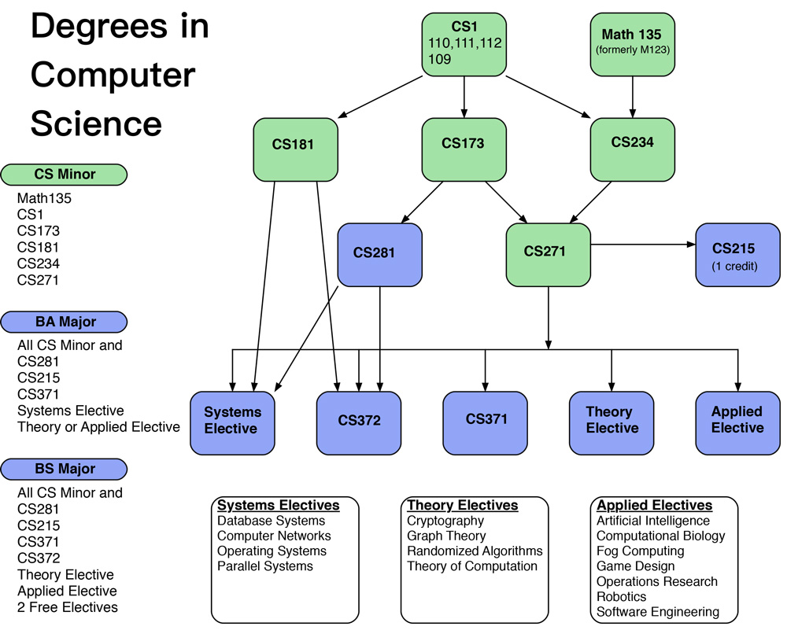

# _Denison University_
Contributed by _Jessen Havill_, _havill@denison.edu_

## Institutional and departmental context
- Location: Granville, Ohio
- Student body size: _2,300 students (all undergraduate)_
- Degree(s) offered: _BA, BS_
- Department/major name: _Computer Science_
- Number of contributing faculty: _7 FTE_
- Number of majors annually: _25 majors and 5 minors_

## Curricular overview

### Major programs

#### Core Courses

_The following eight 4-credit courses and one 1-credit course are required by both the BA and BS._

- Discovering Computer Science (one of the following)
  - Scientific Data and Dynamics (CS 111)
  - Markets, Polls, and Social Networks (CS 112)
  - Digital Media and Games (CS 110)
  - Storytelling (new)
- Single variable Calculus (MATH 135)
- Intermediate Computer Science (CS 173)
- Data Systems (CS 181)
- Mathematical Foundations of Computer Science (CS 234)
- Data Structures (CS 271)
- Introduction to Computer Systems (CS 281)
- Algorithm Design and Analysis (CS 371)
- Technical Communication (CS 395, 1 credit)

#### Bachelor of Arts

_The BA requires the core plus 2 courses (10.25 total):_
- one systems elective
- one theory or applied elective

#### Bachelor of Science

_The BS requires the core plus 5 courses (13.25 total):_
- Operating Systems (CS 372)
- one theory elective
- one applied elective
- 2 more electives

#### Elective Categories

_Systems_
- Operating Systems
- Parallel Programming
- Compilers
- Computer Networks
- Database Systems

_Theory_
- Theory of Computation
- Probability, Computing, and Graph Theory
- Randomized Algorithms

_Applied_
- Computational Biology
- Game Design
- Operations Research
- Artificial Intelligence
- Software Engineering
- Fog Computing
- Robotics
- Natural Language Processing
- Natural Computation

### Non-major programs

- The introductory _Discovering CS_ courses are designed to be taken by any student with no pre-requisites.  We are currently offering about 8 sections per year.  The course is also required by the Mathematics and Data Analytics majors, and the Neuroscience concentration.  It is an option for some other BS degrees.
- The CS minor requires the first 6 courses in the core (above).
- We also participate in the Data Analytics (DA) program.  The introductory DA course is open to all students.

### Co-curricular program(s)

- summer research opportunities
- internship support through the career development center
- monthly _Pizza and Puzzles_ gatherings (with Mathematics and Data Analytics)
- monthly _Computing and Coffee_ discussions
- _Pi-athlon_ event on Pi Day (with Mathematics)
- Gordon lecture series
- annual Spring Programming Contest hosted at Denison
- ACM programming contest
- Upsilon Pi Epsilon
- TRIWiC participation

## Key contributions

- Our introductory _Discovering Computer Science_ courses were designed, starting about ten years ago, to be of interest and accessible to students in any discipline.  We currently have three "flavors" of the course in the catalog (listed above), plus a new "Storytelling" flavor, which expects less mathematical comfort, that is being developed by one of our new CS colleagues.  Development of these courses led to the textbook [Discovering Computer Science](http://discovercs.denison.edu).  A second edition is underway.

- A number of CS faculty were instrumental in the creation of Denison's interdisciplinary [Data Analytics program](https://dl.acm.org/doi/10.1145/3287324.3287436), now in its fourth year.

- Parallel to the development of the Data Analytics major, we created a new _Data Systems (CS 181)_ course that is now required for both the DA and CS majors.  This applied course is organized around four different data models -- tabular, relational, hierarchical, and unstructured (text) -- and how to work with them in client-server environments.  The only prerequisite is the introductory CS course.  Since no textbook currently exists for such a course, [one is being developed](https://dl.acm.org/doi/10.1145/3287324.3287425) by our colleague Tom Bressoud.  This course also guarantees that all CS majors are introduced to databases, from a practical point of view, even if they do not take a more advanced database elective.

- Over the years, we have struggled with how to best teach discrete mathematics and writing proofs to CS majors.  We want this course to be both rigorous and contextual, to convey the importance of mathematics to the discipline.  We have recently settled on an approach that seems somewhat obvious in retrospect: introduce these topics in the context of the basics of the theory of computation.  The content of this new course, _Mathematical Foundations of Computer Science (CS 234),_ includes finite automata, regular languages, and the basics of Turing machines (no pushdown automata or context-free languages), far less than the typical Theory of Computation course, to make it more appropriate for the sophomore level and provide room for explicit mathematical and proof-writing instruction.  Our optional _Theory of Computation (CS 334)_ elective builds on this course, but CS 234 guarantees that all CS majors have some exposure to automata and Turing machines.

- We have always been proud of our longer-than-typical data structures-algorithms sequence.  Our _Intermediate Computer Science (CS 173)_ course introduces C++ programming, the implementation of linear data structures, and the basics of asymptotic notation and sorting.  This is followed by _Data Structures (CS 271),_ which steps up the mathematical rigor and covers priority queues and heaps, trees, graphs, hash tables, and an introduction to dynamic programming.  Finally, _Algorithm Design and Analysis (CS 371)_ covers the canonical algorithm design techniques of divide and conquer, dynamic programming, backtracking, greedy, and network flow, along with an introduction to the theory of NP-completeness.  This course also satisfies a college-wide writing requirement.

- Our 1-credit _Technical Communication_ course is required of all CS and Mathematics majors.  In it, students are instructed in effective oral communication of technical topics to a general audience, and they deliver a progression of talks of increasing duration over the semester.  We wrote a [paper](https://dl.acm.org/doi/10.1145/1227504.1227375) about the course in 2007.

## Limitations/challenges

- As the number of students taking CS classes has grown, so has the disparity in preparation and deep motivation.  Are others seeing these issues as well, and what can be done to reach all students without sacrificing rigor?

- We are running out of space to teach CS classes, as the numbers of both students and faculty has grown.  We are also short on offices, lab space, and social spaces for CS students.  This has taken on serious toll on department culture.  We have come up with some creative solutions, like dual boot machines and retrofitting a chemistry computer lab.  We are in talks with the administration which will hopefully soon finally bear fruit.  In the meantime, any suggestions?

- While our prerequisite structure does allow students starting in their second year to complete a BA, it is sometimes tricky to fit everything in the right order.  What ideas do folks have about flattening the prerequisite chain? 
