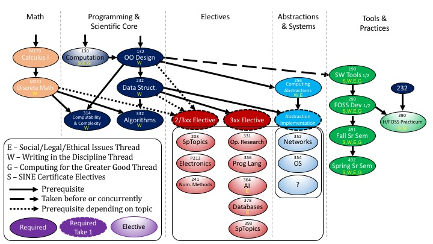

# Dickinson College
Contributed by Grant Braught, braught@dickinson.edu

## Institutional and departmental context
- Location: Carlisle, PA 17013  USA
- Student body size: 2400
- Degree(s) offered: BS Computer Science
- Department Name: Department of Mathematics and Computer Science
- Number of contributing faculty: 4 FTE, 3 tenure-track, 1 Instructor/Technician
- Number of majors annually: approximately 20

[Dickinson College](https://www.dickinson.edu/homepage/284/about_overview) was founded in 1783 by Dr. Benjamin Rush, a signer of the Declaration of Independence, "to prepare young people, by means of a useful education in the liberal arts and sciences, for engaged lives of citizenship and leadership in the service of society."

The Dickinson computer science curriculum leverages our strengths while preparing students for a future in which they apply their skills and knowledge for the greater good. To do so the curriculum:
- maintains strength in the scientific core of the discipline (data structures, algorithms, computability and complexity).
- improves the development of future ready skills and a service ethic though participation in Humanitarian Free and Open Source Software (HFOSS) projects.
- establishes thematic cross-cutting threads that emphasize the following as essential aspects of how computer scientists think:
  - Written communication (10 courses).
  - Social, legal and ethical issues (8 courses).
  - Computing for the greater good (6 courses).
- can be completed in 3-years (e.g. starting in 2nd year) with a semester-long study abroad experience.
- provides introductory courses satisfying all college requirements for _Laboratory Science_ and _Quantitative Reasoning_ while also providing entry points to the major.

## Curricular overview

### Major program

The computer science major requires a total of 13 courses, 11 in computers science (8 required, 3 electives) and 2 in mathematics.
- Required of all computer science majors:
  - COMP 132 - _Principles of Object-Oriented Design_
  - COMP 190 - _Tools and Techniques for Software Development_ (1/2 course)
  - COMP 232 - _Data Structures and Problem Solving_
  - COMP 256 - _Computing Abstractions_
  - COMP 290 - _Large-scale and Open Source Software Development_ (1/2 course)
  - COMP 314 - _Computability and Complexity_
  - COMP 332 - _Analysis of Algorithms_
  - COMP 491 & COMP 492 - _Senior Seminar_ (year-long)
  - MATH 170 - _Single Variable Calculus_
  - MATH 211 - _Discrete Mathematics_

- One of the three electives must be classified as an _Abstraction Implementation_ course. All Abstraction Implementation courses have _COMP 256_ as a prerequisite and require a implementation project touching at least three levels of abstraction (e.g. Operating Systems, Architecture, Networking, Compilers, Full-stack Web Development).

The diagram below illustrates the structure of the major and how the threads of: Writing in the Discipline; Social, Legal and Ethical Issues; and Computing for the Greater Good weave through the courses.

### Non-major program(s)

- [COMP130 - _Introduction to Computing_](https://dickinson-comp130.github.io/COMP130/), is an introduction to computational thinking and programming in Python for students from across the college. The course satisfies the all college requirements for _Laboratory Science_ and _Quantitative Reasoning_ and also serves as an entry point to the major for those without prior experience.

- The department offers a minor in computer science. The minor requires six credits including COMP 132, COMP 190, COMP 232 and COMP 256.

- Computer science courses on our _Computing for the greater good_ thread count as electives in the [Social Innovation and Entrepreneurship (SINE)](https://www.dickinson.edu/homepage/687/social_innovation_and_entrepreneurship_) certificate program.

### Co-curricular program(s)

The department has a number of co-curricular programs:
- Competitive Programming Club: Students practice approximately weekly, compete in a few "warm-up" competitions and the ACM Regional Competition each fall and a Dickinson hosted competition each spring.
- Math/CS Chat series: The department sponsors a colloquium series with 4-6 speakers per semester.
- The Math and Computer Science Society (MCSS): A student club organizes social events, academically relevant trips and is considering expanding into _TEDx_ style talks and _Hackathons_.

## Key contributions

- We are excited about the threaded themes within the curriculum. By having smaller doses of writing, ethics and social value appear repeatedly we hope to emphasize these elements an integral part of of how computer scientists think.  In addition these themes provide opportunity for students in the liberal arts to draw on their collective broad education to examine the ways in which technology creates, addresses and interacts with human challenges.

- With the support of our Director of Writing we have been able to interpret writing in the discipline (WID) broadly. The writing elements in our courses include writing code for human readers, API documentation, expressing algorithms in pseudo code, writing mathematical arguments (proofs), poster presentations, blog posts for broad audiences and reflective essays as well as more traditional technical reports.

- We have reformulated the traditional organization and architecture and systems sequence as a sequence in abstractions. This makes the larger concept of abstraction the central theme and provides for breadth at the intermediate level (COMP 256 includes organization, architecture, operating systems, languages and translation, networking, web architectures). This is then followed by topic focused courses with rich implementation projects that satisfy the abstraction implementation requirement.

- Incorporating Free and Open Source Software (FOSS) and Humanitarian FOSS (HFOSS) as a central theme has provided a motivating context for our courses that emphasize Tools and Practices.  The humanitarian aspects connect us directly to the institutional mission while supporting the Social, Legal and Ethical and Computing for the Greater Good threads.  This theme also holds potential for broadening participation in the discipline.

## Limitations/challenges

Our Writing in the Discipline thread satisfies the all-college writing in the discipline (WID) graduation requirement.  In other disciplines this is satisfied by 1 (or 2) courses that students must complete.  When they complete those courses they are given the WID credit.  For our model we must compile a portfolio of student writing across the courses in our thread and certify at the end of the major that they have satisfied the WID.  Thus, we would be interested in any experiences with such a model and/or solutions for portfolio management.
