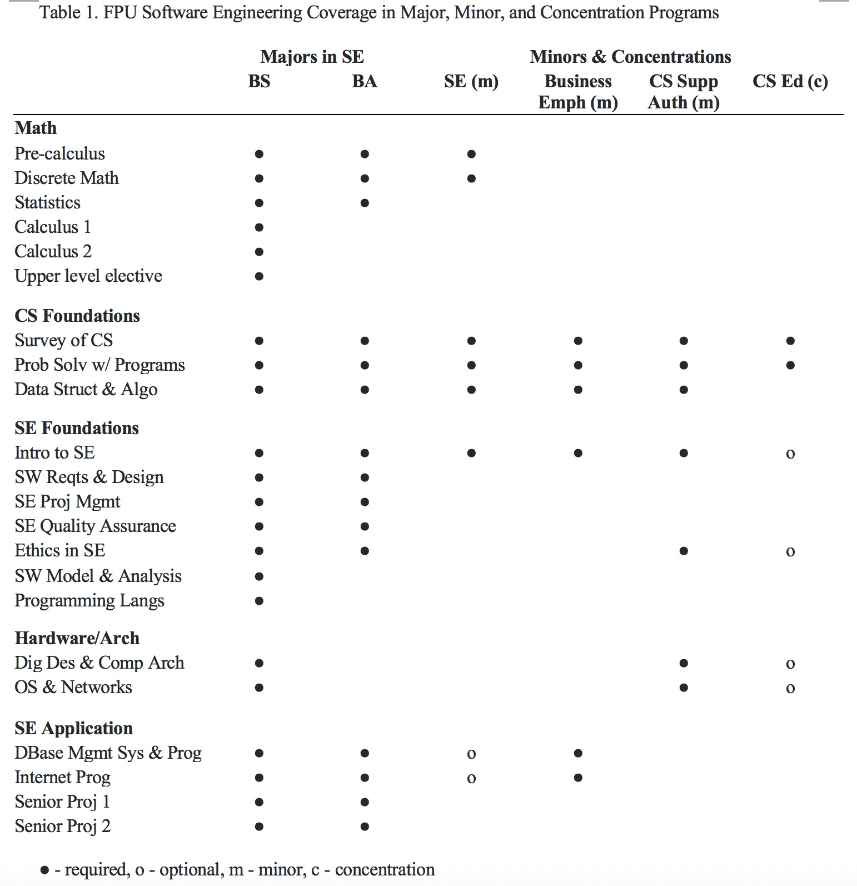
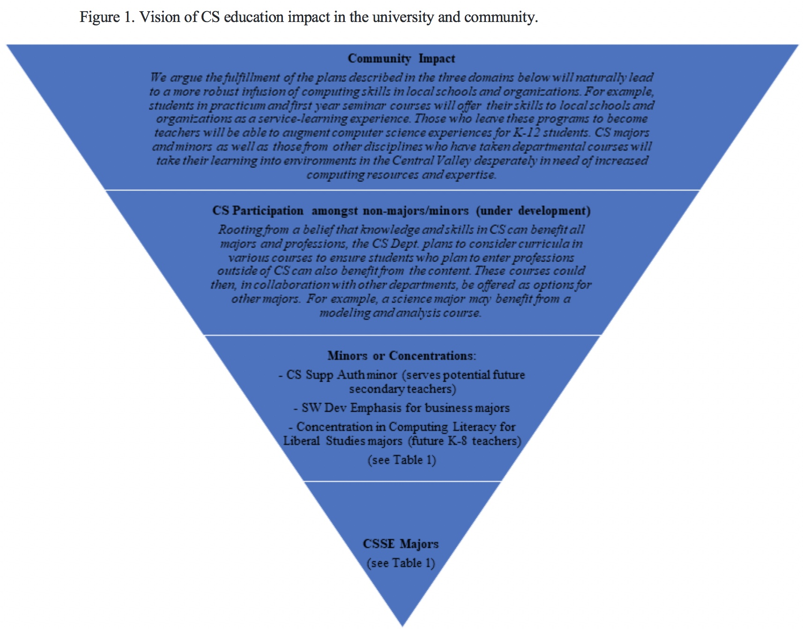

# Fresno Pacific University
Contributed by Simon Sultana, simon.sultana@fresno.edu and Whitney Bortz, whitney.bortz@fresno.edu

## Institutional and departmental context
- Location: Fresno, California
- Student body size: 4109 students
- Degree(s) offered:  Software Engineering B.A. & B.S.
- Department/major name:
  - Dept. of Mathematics and Computer Science: Software Engineering B.A. & B.S.
  - Humanities, Religion, and Social Science Department: Liberal Studies, B.A.
- Number of contributing faculty: 2 FTE
- Number of majors annually: 5-10 (third year)

Fresno Pacific University (FPU) is in California’s Central Valley and combines studies in the liberal arts with professional preparation.  The local poverty rate is over 21% and the unemployment rate is 5.8%. Only 20.1% of residents earn a bachelor's degree, making the area among the least educated in the country (U.S. Census Bureau, 2018).

The job outlook in the region, however, provides some reason for optimism. The California Employment Development Department (2016) projects that Fresno County is expected to experience an increase of 9.7% in all occupations in the time period 2016-2026. Among the most in demand will be applications software developers, projected to increase at a rate of 30%. We aim to meet the educational needs of students, many from backgrounds (over 50% Hispanic) which have historically been underrepresented in technical fields, who aspire to pursue careers in practicing software engineering or teaching computer science (CS).

The Department of Education recently published the California Computer Science Strategic Implementation Report. This report includes California’s recently adopted CS standards as well as a call for providing equitable access for all students to CS education. The support of K-12 educators who teach CS is identified as a primary means of achieving this goal. The partnership between the liberal studies and CS programs at FPU will initiate opportunities for future K-8 teachers to gain foundational knowledge in CS concepts that can later be shared with their K-8 students, thus broadening participation of students at both the undergraduate and K-8 levels.

## Curricular overview

### Major program(s)
Bachelor of Arts in Software Engineering (35 units) and Bachelor of Science in Software Engineering (45 units). Program includes foundational CS and software engineering (CSSE) and courses in software design, quality assurance, project management, internet programming, database systems and programming, and ethics. The curriculum is designed to address the recommendations of the [Joint Task Force on Computing Curricula.](https://www.acm.org/binaries/content/assets/education/se2014.pdf)

### Non-major program(s)

Minor in Software Engineering (18 units). Courses include foundational CSSE, discrete mathematics, and elective choice.

Bachelor of Arts in Business Administration with Software Development Emphasis (18 units). Courses include foundational CSSE, internet programming, and database systems and programming.

Minor in CS Supplementary Authorization (21 units). Designed to address State of California Supplementary Teaching Authorization in CS requirements. Courses include foundational CSSE, ethics, computer architecture and digital design, and operating systems and networks.

Concentration in CS Education for Liberal Studies majors: The liberal studies major currently requires students to choose a concentration from over twenty different disciplines. Students take 12-14 units in this discipline. The program director is currently reevaluating concentration options and current demands in K-12. An observed need is to offer liberal studies students the option of specialized training in computational skills. This can enable their soon-to-be required instruction of the California CS standards for K-12 while also developing skills for enhancing curricula with technology resources. In line with the goals of both community outreach and broadening participation, students will complete units of foundational coursework in CS and a one-to-three-unit practicum that includes offering CS experiences to students in local schools.

See Table 1 for specific courses in these program offerings.

### Co-curricular program(s)

We have recently joined the Computing Alliance of Hispanic-Serving Institutions and hope to get our students engaged with this community and students at other regional institutions. We also hope to start a student ACM chapter soon.

## Key contributions

One of the authors performed academic research to identify the requirements of the region and we have relied heavily on input from other institutions and industry in designing curriculum. Because of limited resources and small class sizes, we aim to use the same courses to meet requirements for different major and minor offerings. This approach and collaboration with the liberal studies program can also be a test case and example to other institutions who wish to broaden participation in computing at multiple levels.

Our vision is presented in Figure 1.

## Limitations/challenges

One of our biggest challenges thus far has been attracting students to these new programs. Local high schools have not historically offered courses in CS, though some have recently started. Another challenge has been retaining students, who seem underprepared for the workload in engineering courses.

## References

- California Department of Education. (2019). California Department of Education Report to the
Legislature, Department of Finance, State Board of Education, and the Legislative Analyst’s Office: California Computer Science Strategic Implementation Plan. Sacramento, CA: Author. Retrieved from https://www.cde.ca.gov/pd/ca/cs/index.asp
- California Employment Development Department (2016). 2016-2026 Local employment
projections highlights. Retrieved from https://www.labormarketinfo.edd.ca.gov/data/
employment-projections.html
- U.S. Census Bureau (2018). QuickFacts: Fresno County, California. Retrieved from
https://www.census.gov/quickfacts/fact/table/fresnocountycalifornia/PST045218
