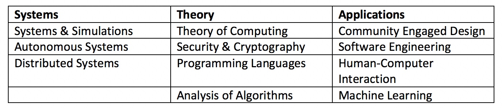

# Fulbright University Vietnam
Contributed by Sebastian Dziallas, sebastian.dziallas@fulbright.edu.vn  
Curriculum developed in collaboration with Clif Kussmaul and Raghu Ramanujan

## Institutional and departmental context
- Location: Ho Chi Minh City, Vietnam
- Student body size: 113 students in the first graduating class (the Class of 2023), with an expected steady state of around 3000 students in roughly ten years
- Degree(s) offered: Bachelor of Sciences in Computing
- Department/major name: Fulbright aims to create an interdisciplinary learning environment and does not have any departments. (Fulbright also offers degrees in the arts, humanities, social sciences, mathematics, natural sciences, and engineering.)
- Number of contributing faculty: Currently 1 FTE and one visiting faculty member, expected to grow to 3 FTE in the short term
- Number of majors annually: Currently around 15 students pursuing courses in computing

Fulbright University Vietnam is one of the first private, non-profit institutions of higher education in Vietnam and offers an education inspired by American liberal arts traditions. It embraces active learning in a project-based, interdisciplinary learning environment. The university has recently concluded its co-design year, as part of which a group of 54 students (“co-designers”) worked with faculty and staff to design curriculum and culture of the nascent institution. As the university is currently in its first academic year, much remains a work-in-progress. However, we are excited about the curriculum we have developed so far.

## Curricular overview

### Major program(s)

All students at Fulbright, regardless of major, are expected to complete a total of 32 courses, including:

- 7 core courses, across a number of disciplines, including a course entitled _Logic & Limitations_.
- At least two three-course sequences, so-called _streams_, which introduce students to the foundations of their disciplines.
- A _Transition to Major_ course, as part of which students develop and defend their major plan at the end of their second year at Fulbright.
- A set of eight additional major courses, as defined in the student’s major plan.
- A capstone project (including two dedicated courses) consistent with the student’s major plan.

For computing students, their stream consists of the following four (rather than three) courses:

- UG2061: Computer Science I: Computing with Data
- UG2062: Computer Science II: Data Structures
- UG2063: Discrete Mathematics
- UG2064: Computer Organization

The computing major then requires a total of 14 courses: 4 stream courses, 8 major courses, and 2 capstone courses.

Going forward, we initially plan to offer approximately 10 distinct major and elective courses, with the aim to increase this as we grow. They will include:

### Non-major program(s)

Students are first exposed to elements of computing in the _Logic & Limitations_ core course. This course introduces a variety of topics, including proofs, complexity, and programming (in Blockly and Python).

Those interested in pursuing computing as a non-major are then encouraged to enroll in the courses in the computing stream. Indeed, the stream was specifically designed to also appeal to students who are interested in other areas of study.

While the first two courses in the stream (CS1 and CS2) are required, non-majors are only expected to complete three stream courses and can choose their third course from a select number of offerings, including _Human-Computer Interaction_.

### Co-curricular program(s)

As Fulbright is still very much in start-up mode, with a small number of faculty and students, co-curricular opportunities are still emerging.

However, there are already potential synergies with the recently launched _Center for Entrepreneurship and Innovation_ at the university, which has already organized hackathons, entrepreneurship competitions, and other events for students and the public alike.

Additionally, the Fulbright Speaker Series hosts scholars and industry speakers, including in computing. Finally, a group of students has already formed a team to compete in the _International Collegiate Programming Contest_.

## Key contributions
The computing curriculum at Fulbright builds on many aspects that are common across the different majors, such as the interdisciplinary core experience, as well as the overall program structure with streams leading to a deliberate transition to major. However, in addition to this, the computing curriculum was designed with the following considerations in mind, which may be of interest to other institutions:

- The computing stream should appeal to students who are interested in other areas of study, permitting non-majors to pursue courses of interest to them.
- It should cover the fundamentals of the discipline in order to equip students to defend their choice of major courses in their plan of study.
- Following their transition to major, computing students should have flexibility in their choice of major and elective courses. This has led to a rather flat prerequisite structure, meaning that there are few prerequisites for advanced courses beyond the completion of the computing stream.

## Limitations/challenges
In addition to the challenges and opportunities associated with being a start-up institution, some of the challenges we encounter at Fulbright are common to other institutions, such as the need to balance the demands of the computing program with those of other programs (e.g. engineering), as well as the general education requirements. Similarly, the small size of the faculty is a natural limitation for the time being. This is related to challenges of hiring computing faculty, which has proven difficult for many institutions. With this in mind, we also welcome inquiries about visiting positions for a term or year.
