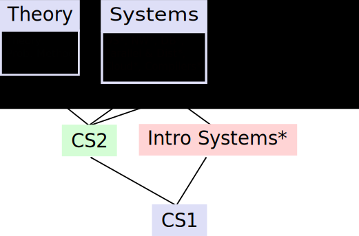

# Swarthmore College
Contributed by
- Tia Newhall, newhall@cs.swarthmore.edu
- Rich Wicentowski, rwicent1@swarthmore.edu
- Andrew Danner, adanner1@swarthmore.edu
- Ameet Soni, soni@cs.swarthmore.edu

## Institutional and departmental context
- Location: Swarthmore, PA
- Student body size: 1667 students
- Degree(s) offered: B.A.
- Department/major name: [Computer Science](https://cs.swarthmore.edu)
- Number of contributing faculty: 9.5 FTE (9 Tenure Track Faculty), plus two (2) lab instructors.
- Number of majors annually: 60-70 majors
- Swarthmore is a liberal arts college.

## Curricular overview

Our departmental **goals for the Computer Science major** state that students should:

* Be able to apply problem solving skills to formalize general problem statements into precise algorithmic solutions
* Become proficient programmers
* Demonstrate an understanding of the interplay between theory and practice
* Demonstrate adequate competency in theory, systems, and applications, the three main areas of the computer science curriculum.
* Have a broad exposure to computer systems.
* Have experience conducting research and completing large projects; often such projects will require a team effort.
* Be able to apply the computational and algorithmic problem solving skills learned in computer science across many disciplines.

Additionally, we aim to broaden participation and ensure our curriculum appeals to a wide variety of backgrounds and preparations.

Full [details of our program](https://www.swarthmore.edu/computer-science/honors-majors-and-minors) are
available on our website.

### Major program(s)

The following are the requirements for a major in computer science (eight credits in Computer Science):

* Three introductory courses: Introduction to Computer Science (CS21), Introduction to Computer Systems (CS31), and Data Structures and Algorithms (CS35).
* Three upper-level CS requirements: One course from each of the following groups:
  - **Theory Group**: Algorithms (CS41) or Theory of Computation (CS46)
  - **Systems Group**: Computer Networks (CS43), Database Systems (CS44), Operating Systems (CS45), Compilers (CS75),Parallel and Distributed Computing (CS87), or Cloud Systems and Data Center Networks (CS89).
  - **Applications Group**: Computer Graphics (CS40), Computer Animation (CS56), Artificial Intelligence (CS63),  Natural Language Processing (CS65),  Machine Learning (CS66),  Bioinformatics (CS68), Software Engineering (CS71), Programming Languages (CS73) or Adaptive Robotics (CS81)
* Two upper-level CS electives.  
* Two credits in Math at the level of Linear Algebra (MATH27) or above. Discrete Math and Linear Algebra are recommended. Students may satisfy one of these requirements with Statistical Methods II (STAT21).

### Non-major program(s)

The following are the requirements for a minor in computer science (six credits in computer science)

* Three introductory courses
* Three upper-level CS courses, at least two of which are in different groups.
* One credit in Math at the level of Linear Algebra (MATH27) or above.

### Co-curricular program(s)

The department supports a number of co-curricular programs:

* An active [Women in Computing](https://www.cs.swarthmore.edu/wics/) student group
* [Summer research experiences](https://www.swarthmore.edu/computer-science/summer-research) for our students
* Training and teams for the International Collegiate Programming Competition (ICPC)

## Key contributions

1. **The curriculum is designed to provide both breadth and depth in computer science.** This design allows for flexibility in our upper-level course offerings so that faculty can design new courses and adapt to specialties of new and visiting faculty. Our introductory sequence consists of 3 courses:  CS21: Introduction to Computer
Science (our CS1 course); CS35: Data Structures and Algorithms (our CS2 course); and CS31: Introduction to Computer Systems. Each of our upper-level courses is situated in one of three groups: Theory, Systems, or Applications.  We ensure breath in our major by requiring all majors take at least one course from each group.  Additionally, majors have upper-level elective requirements that provide a means for students to explore specific areas of interest in more depth. The figure below shows the design and prerequisite structure of our curriculum. (Course names followed by an asterisk are courses where we have introduced parallel and distributed concepts. See item 3 below for further discussion of this.)

2. **Student Mentor Program in our three introductory courses**.  Our
  [CS Ninja](https://www.swarthmore.edu/computer-science/ninjas) program
was designed, in part, to improve retention and recruitment of underrepresented
students, and to provide a more helpful, welcoming and supportive environment
for our introductory students. Student ninjas are selected from students who
recently completed the course.  We choose ninjas who did well in the course,
but who are also patient, responsible, enthusiastic, and helpful to students with all backgrounds and abilities.  We additionally, select a diverse set of
student ninjas because of their importance as mentors.  We have seen a
dramatic improvement in representation in our courses and our major.
Currently, we meet the college-wide demographics for URM and women in our intro course, and are close in our second two courses.  Additionally, approximately 40% of our majors are women (the class of 2020 is 42%).  Details about our Ninja program are in our [SIGCSE 2014 paper](https://dl.acm.org/doi/10.1145/2538862.2538923)

3. **Introduce parallel computing in our introductory course sequence**,
  and expanded coverage in upper-level courses.
  One of our second courses, CS31, introduces shared memory parallel computing
  with pthreads, including synchronization.  CS31 also adds important
  background in systems, machine organization, and C programming that
  is a prerequisite to our upper-level Systems Group courses. All of our Systems Group courses include some coverage of parallel and
  distributed computing (PDC) topics, ensuring that every major has
  exposure to PDC at the introductory and advanced level through their
  group requirement.  The addition
  of a CS31 prerequisite has freed up time in our upper-level courses
  where we used to introduce some of its content, and allowed us to expand
  coverage of PDC topics in these courses (the starred courses in our
  curriculum figure include PDC topics).  Details about the PDC parts of
  our curriculum are in our [2017 Journal of Parallel and Distributed
  Computing paper](https://www.sciencedirect.com/science/article/pii/S0743731517300114).  

## Limitations/challenges

* **Lack of predictability in course offerings**.  We struggle to know what courses we will be offering more than a year ahead, which conflicts with the culture of a having a 2-year schedule at our institution.  This makes it difficult for students to determine their course plan and also for our faculty to prepare in advance.  The main cause of this lack of predictability is our reliance on 3+ visiting faculty each year.  Without knowing their abilities/areas of expertise, it is difficult to slot visitors into existing courses.   In addition, it may be a necessary cost to ensuring the flexible curriculum noted above.  

* **Limited experiences in CS**.  Our major currently requires students to take only 8 courses in Computer Science, a reduction from nine courses.  This reduction was made in response to high enrollments.  We removed the senior capstone requirement, eliminated most seminar courses, and capped the number of courses any student could take to 9 courses.  The result of these changes is that our students have fewer experiences in computer science.  In particular, seminars and our capstone course guaranteed that students had at least one project-based course (usually more). With the loss of these courses in our curriculum, many seniors now graduate without satisfying one of the main goals of our CS major. 

* **Lack of verticality** to curriculum results in varying preparations for students and overlap in courses. Students can take upper-level courses in any order.  For example, students may take Machine Learning before Artificial Intelligence, or the other way around, or only one of those courses.  This also means that rigorous upper-level courses (e.g., seminars) may taken as a student's first upper-level course.  This makes teaching the course difficult as there is a wide range of abilities coming into the course and a need to teach overlapping content in both courses.  In addition, departmental autonomy limits our ability to require specific math courses, or even the timing of when these courses are taken.

* **Trade-offs between ensuring diversity and relieving enrollment pressures**.  Many of the options to reduce enrollments often have the effect of discouraging students who came to the major late, did not have a computer science experience prior to matriculating, and/or have interdisciplinary interests between CS and another discipline.  These students tend to be more diverse than traditional computer scientist and thus these options to reduce enrollments are not appealing options to us.  However, this has left us under the strain of high enrollments with no end in sight.  
